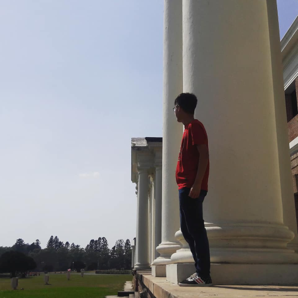
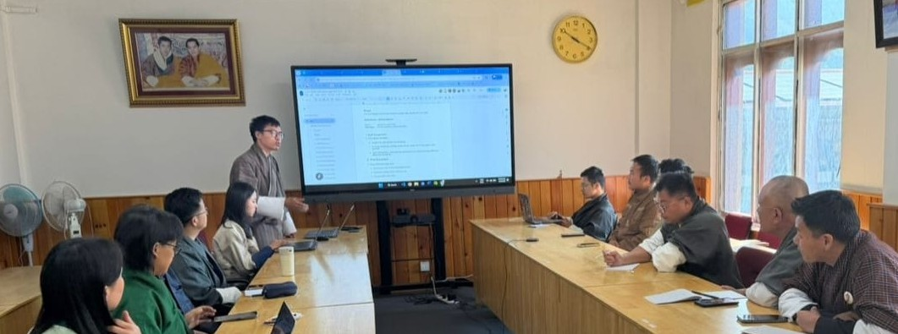

---
hide:
  - toc
  - navigation
---

  
  <h1>Jigme Namgay</h1>
  
<strong>Survey Engineer / Geoinformatics Engineer</strong>

  
<em>Turning spatial data into insights | GIS | Remote Sensing | Python</em>

---

## About Me

A Geoinformatics Engineer with a strong foundation in GIS, remote sensing, and spatial data management, currently working on national-level geospatial projects in Bhutan. My experience spans spatial data quality control, satellite image processing, Land Use and Land Cover mapping, and cartographic production using tools like ArcGIS Pro, QGIS, and Google Earth Engine. I'm driven by solving real-world spatial problems — from suitability modeling and multi-criteria decision analysis to data quality and terrain analysis — and I enjoy the process of turning complex spatial questions into clear, actionable geospatial insights. Alongside this, I've been expanding into web GIS development, building geospatial web applications with PostGIS, Node.js, OpenLayers, Astro, and Python-based automation to make spatial data more accessible and usable. I'm looking to grow further as a geospatial analyst and developer, tackling challenging GIS problems while continuing to build impactful, scalable geo-applications.

  

---

[View My Projects :material-arrow-right:](projects/index.md){ .md-button .md-button--primary }
[Download CV :material-download:](assets/Jigme Namgay-CV.pdf){ .md-button }

---

## Skills

- :material-layers:{ .lg .middle } **GIS & Remote Sensing**

    ***
    - ArcGIS Pro, ArcGIS Online, ArcGIS Enterprise
    - QGIS, Google Earth Engine, Google Earth Pro
    - ERDAS Imagine, TerrSet
    - Sentinel-2 satellite image processing
    - Land Use and Land Cover (LULC) mapping
    - Terrain analysis and cartographic production

- :material-code-braces:{ .lg .middle } **Programming & Web Development**

    ***
    - Python — GeoPandas and spatial data workflows
    - GIS workflow automation
    - JavaScript, Node.js and Express (REST APIs)
    - OpenLayers and Chart.js (web maps and dashboards)
    - Astro framework
    - Git and GitHub version control
    - VS Code
    - Web GIS application development

- :material-database:{ .lg .middle } **Data Management**

    ***
    - PostgreSQL, pgAdmin
    - PostGIS — spatial SQL, overlay analysis, GeoJSON export
    - MapServer (WMS publishing)
    - Relational Database Management Systems (RDBMS)
    - Geospatial data quality control (topology, attribute validation)
    - Metadata management, national data standards

- :material-map:{ .lg .middle } **Analysis & Planning**

    ***
    - Spatial analysis and visualization
    - Multi-Criteria Decision Analysis (MCDA)
    - Digital photogrammetry and image interpretation
    - Geostatistical analysis and spatial modelling

- :material-palette:{ .lg .middle } **Design & Visualization**

    ***
    - Adobe Photoshop
    - Visily (wireframing and UI design)
    - Cartographic map production
    - Thematic and web map design

---

## Connect

[GitHub](https://github.com/Jimme09){ .md-button }
[LinkedIn](https://linkedin.com/in/jigme-n){ .md-button }
