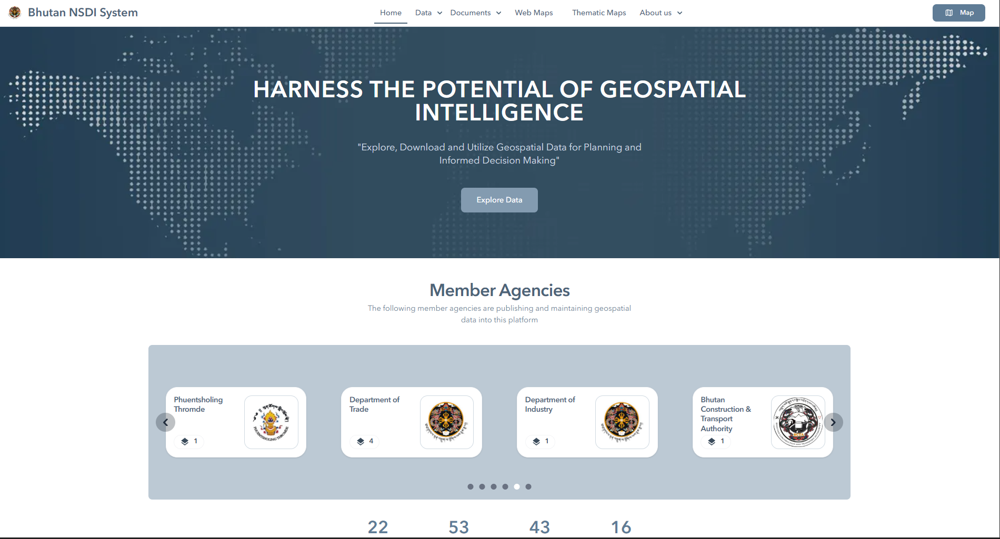

<!--
CHECKLIST FOR THIS PAGE (copy this file for each new project):
- [ ] Replace [YOUR PROJECT TITLE] with your project title
- [ ] Replace the hero image with your own (add to docs/assets/images/)
- [ ] Update the Overview section
- [ ] Update the Methods & Tools section
- [ ] Update the Key Findings section
- [ ] Update the Links section
- [ ] Add a card for this project on docs/projects/index.md
- [ ] Add a nav entry in mkdocs.yml
-->

# Bhutan National Spatial Data Infrastructure (NSDI)

## Overview

Contributed to the development of Bhutan's National Spatial Data Infrastructure (NSDI), a joint initiative between the National Land Commission Secretariat (NLCS) and the Japan International Cooperation Agency (JICA) to centralize the acquisition, management, and sharing of geospatial data nationwide. The platform now serves 21 contributing agencies with over 113 datasets, giving government bodies, academic institutions, consultants, and the public a single point of access to reliable geospatial data for planning and decision-making.

**Study Area:** National (Bhutan)
**Duration:** July 2024 – Present
**Role:** Contributor (collaborating with a senior official)
**Status:** In progress

---

## Methods & Tools

**Data Sources**

- Geospatial datasets contributed by 21 government agencies, sourced through direct stakeholder coordination
- NSDI platform content (About, NSDI Component, Contact Us pages)

**Processing Steps**

1. Co-designed the website layout and wireframes in Visily with a senior official
2. Designed the homepage hero image in Adobe Photoshop
3. Built the About, NSDI Component, and Contact Us pages using Astro and JavaScript
4. Pushed changes via Git and coordinated with stakeholder agencies to collect and integrate geospatial data
5. Designed promotional posters for the NSDI launch event

**Tools Used**

| Tool            | Purpose                                        |
| --------------- | ---------------------------------------------- |
| Astro           | Frontend framework for building platform pages |
| JavaScript      | Page functionality and interactivity           |
| Adobe Photoshop | Hero image and launch event poster design      |
| Visily          | Website layout and wireframe design            |
| Git / GitHub    | Version control and change management          |

---

## Key Findings

- Platform now supports 21 data-contributing agencies and 113 total datasets
- Centralized access model reduces friction for agencies, researchers, and the public needing geospatial data
- Successfully launched with dedicated event materials and stakeholder buy-in

---

## Links

[View Live Site](https://nsdi.systems.gov.bt/){ .md-button }
[View Code on GitHub](https://github.com/Jimme09/NSDI-project.git){ .md-button }
