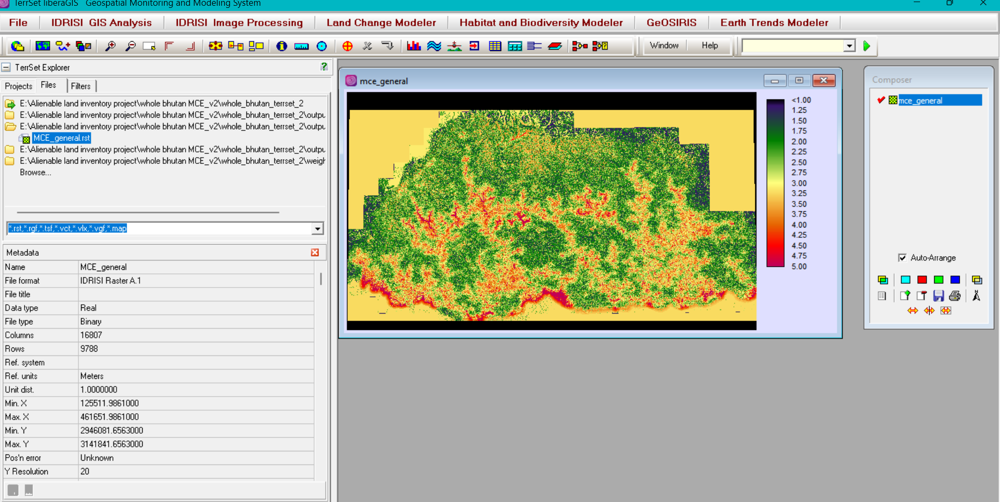

<!--
CHECKLIST FOR THIS PAGE (copy this file for each new project):
- [ ] Replace [YOUR PROJECT TITLE] with your project title
- [ ] Replace the hero image with your own (add to docs/assets/images/)
- [ ] Update the Overview section
- [ ] Update the Methods & Tools section
- [ ] Update the Key Findings section
- [ ] Update the Links section
- [ ] Add a card for this project on docs/projects/index.md
- [ ] Add a nav entry in mkdocs.yml
-->

# Mapping of Alienable Land in Bhutan — GIS-Based MCDA

## Overview

Contributed to a national-level study identifying potentially alienable (state-owned, allocable) land across Bhutan, using a GIS-based Multi-Criteria Decision Analysis (MCDA) framework. The study combined the Analytic Hierarchy Process (AHP) for criteria weighting with Weighted Linear Combination (WLC) for suitability modeling, progressively filtering the national land mass through three constraint scenarios — from gross physical potential down to a final baseline that accounts for legal, physical, and conservation restrictions. As part of the Technical Working Group, I worked on spatial data processing and preparation, and contributed to running the AHP/MCDA suitability model.

**Study Area:** National (all 20 Dzongkhags, Bhutan)
**Duration:** May 2025 – April 2026
**Role:** Contributor — spatial data processing and MCDA/AHP model execution (Technical Working Group)
**Status:** Completed (Technical Report 1 of a multi-report series)

---

## Methods & Tools

**Data Sources**

- Cadastral data, DEM, LULC, and base map — National Land Commission Secretariat (NLCS)
- Tree crown cover and conservation data — Department of Forests and Park Services (DoFPS)
- Settlement and infrastructure data — Department of Human Settlement (DHS)
- Road network data — Department of Surface Transport (DoST)
- Datasets sourced through the Bhutan National Spatial Data Infrastructure (NSDI)

**Processing Steps**

1. Acquired and standardized all spatial datasets to a 20m resolution, projected to DrukRef03 (EPSG:5266)
2. Selected six suitability criteria: slope, elevation, proximity to roads, proximity to settlements, proximity to water bodies, and tree crown cover
3. Derived AHP weights via a pairwise comparison matrix built by the Technical Working Group (Consistency Ratio: 0.0347, within the acceptable threshold)
4. Standardized all criteria layers to a common 1–5 ordinal suitability scale, then applied WLC to generate a continuous suitability surface
5. Modeled three progressive scenarios (the "land funnel"): gross physical potential, physical/legal constraints, and final constraints including protected areas and Ramsar wetlands
6. Converted the final suitability raster to vector polygons, removing slivers and sub-0.5-acre polygons for a clean output

**Tools Used**

| Tool                 | Purpose                                      |
| -------------------- | -------------------------------------------- |
| QGIS                 | Spatial data preparation and post-processing |
| ArcGIS Pro           | Spatial data preparation and post-processing |
| TerrSet (MCE module) | AHP weighting and WLC suitability modeling   |

---

---

## Key Findings

_Final suitability surface generated in TerrSet using AHP-weighted WLC modeling_

- Slope (weight: 0.485) and proximity to settlements (weight: 0.213) emerged as the dominant suitability factors
- Highly Suitable land dropped 58.88% between the unconstrained scenario and the final constrained baseline (from ~1,528,207 acres to ~628,419 acres)
- Moderately Suitable land remained comparatively stable at ~2,431,447 acres, forming the country's main land reserve for future development
- Southern and central-western Dzongkhags (e.g. Wangdue Phodrang, Samtse, Dagana) showed higher development potential than northern and central-eastern regions, which face stricter conservation limits
- Sensitivity testing (±10% weight perturbation) confirmed the model was robust to moderate changes in criteria weighting

---

## Links

[View Report (PDF) :material-file-pdf-box:](../assets/Technical-Report-1-Alienable-Land-MCDA.pdf){ .md-button }
[View Report 2 (PDF) :material-file-pdf-box:](../assets/Technical-Report-2-Desktop-Verification-Field-Validation.pdf){ .md-button }
