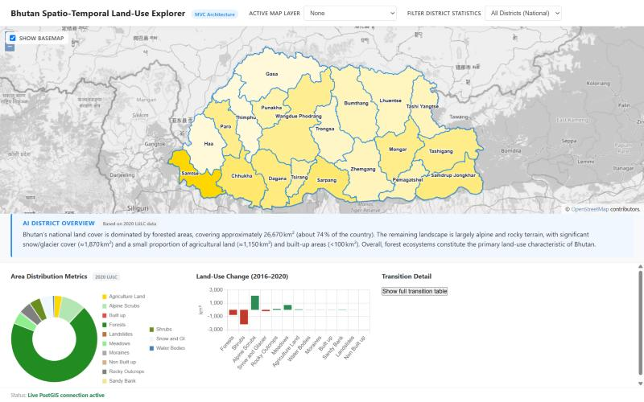
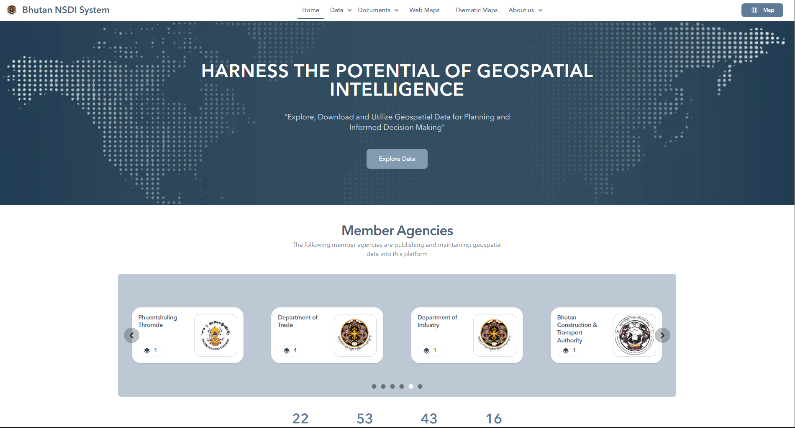
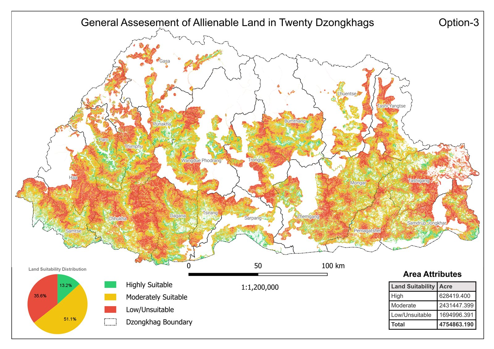

---
hide:
  - toc
  - navigation
---

# Projects

A selection of my geospatial projects. Click any card to see the full write-up.

**[Bhutan Spatio-Temporal Land-Use Explorer](bhutan-lulc-dashboard.md)**

A full-stack web GIS dashboard comparing NLCS LULC 2016 and 2020 across all 20
Dzongkhags. It uses PostGIS overlay analysis to build land-use transition matrices,
with an interactive choropleth map, linked charts and AI-generated district summaries.

`PostGIS` `Node.js` `OpenLayers` `Chart.js` `MapServer`

[View Project →](bhutan-lulc-dashboard.md){ .md-button }

**[NSDI-Project](NSDI-project.md)**

Contributed to Bhutan's National Spatial Data Infrastructure (NSDI), a joint NLCS-JICA
platform centralizing geospatial data for 21+ government agencies — building key pages,
designing the visual identity, and coordinating stakeholder data collection to support
a system now hosting 113+ datasets.

`Astro` `Javascript` `Visily` `Git` `Github` `VS Code`

[View Project →](NSDI-project.md){ .md-button }
[NSDI Site](https://nsdi.systems.gov.bt/){ .md-button }
[GitHub](https://github.com/Jimme09/NSDI-project.git){ .md-button }

**[Mapping of Alienable Land in Bhutan](alienable-land-mcda.md)**

Contributed to a national GIS-based Multi-Criteria Decision Analysis (MCDA) study
identifying potentially alienable land across Bhutan — supporting spatial data
processing and AHP/MCDA suitability modeling as part of the Technical Working
Group, covering all 20 Dzongkhags.

`QGIS` `ArcGIS Pro` `TerrSet` `AHP` `MCDA`

[View Project →](alienable-land-mcda.md){ .md-button }

